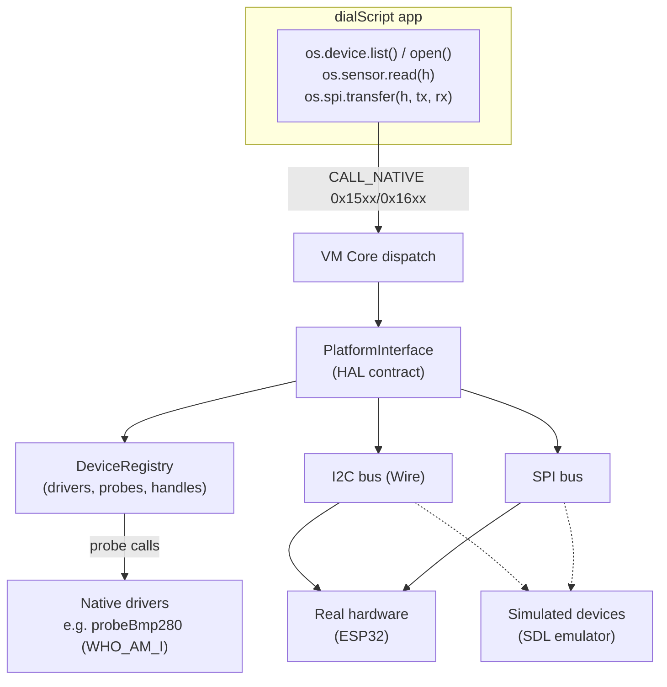

# dialOS Device Driver Model

> **Status:** Tier 1 implemented (registry, SPI, VM dispatch, SDL simulation, ESP32 scaffold).
> This document is both the **design spec** and the **user guide** for plugging external
> modules (sensors, displays, storage) into dialOS via the I2C and SPI buses.

---

## 1. Problem

dialOS runs on the M5 Dial (ESP32-S3). Users can wire additional modules onto the I2C
and SPI buses. Before the driver model:

- **SPI did not exist at all** — no HAL, no API, no way for a dialScript app to touch the bus.
- **I2C was raw-bytes-only** (`os.i2c.read/write`) — no discovery, no device concept.
- **`os.sensor.*` was a stub** — every platform returned `-1`/`"{}"`; the `PORT.A/PORT.B`
  parameter was not backed by any real port enumeration.
- There was no notion of *drivers*, *probing*, *device handles*, or *ownership*.

## 2. Design goals

| Goal | Approach |
|---|---|
| Same dialScript runs on every host | Device discovery & handles live in the **HAL contract** (`PlatformInterface` / `IPlatform`), not in the kernel |
| No new allocation hazards on ESP32 | Registry uses fixed handle table (16 handles), caller-owned strings; mirrors the existing `RamFS` handle pattern |
| Drivers can be native *or* userspace | **Tier 1**: native C++ drivers with hardware `probe()`; **Tier 2** (future): dialScript drivers driving raw bus ops |
| Task isolation | Device handles carry `taskId`; closing/using another task's handle fails (same policy as RamFS files) |
| Hotplug-ready | Descriptors carry a `hotplug` flag; discovery can be re-run via `os.device.probe()` (events blocked until callback infra lands) |

## 3. Architecture



### Key components

| Component | Location | Role |
|---|---|---|
| `DeviceDescriptor` | `include/vm/device_registry.h` | Driver name, bus type, address, capabilities JSON, hotplug flag |
| `ProbeFn` | `include/vm/device_registry.h` | `bool (*)(void* busContext, uint8_t address)` — hardware identification (e.g. WHO_AM_I register read) |
| `DeviceRegistry` | `src/vm/device_registry.cpp` | Driver table, discovery scan, open handles with ownership |
| HAL methods | `include/vm/platform.h` | `spi_open/transfer/write/close`, `device_list/open/close/getInfo/probe` (default: "not supported") |
| VM dispatch | `src/vm/vm_core.cpp` | `CALL_NATIVE` cases for namespaces `0x15xx` (SPI) and `0x16xx` (device) |

## 4. dialScript API (as exposed to apps)

### `os.device.*`

```javascript
// Discover devices (runs probes; returns JSON array string)
var devices: os.device.list();
// => [{"name":"bmp280","bus":"i2c","address":"0x76",
//      "capabilities":{"type":"sensor","provides":["tempC","pressurePa"]}}]

// Open by driver name...
var h: os.device.open("bmp280");
// ...or by address ("i2c:0x76" / "spi:5")
var h2: os.device.open("i2c:0x76");

// Introspect an open handle
var info: os.device.getInfo(h);   // JSON descriptor object

// Release (fails if not owner)
os.device.close(h);

// Re-run bus discovery (e.g. after plugging a module)
var fresh: os.device.probe();
```

**Handle rules**
- One open handle per device at a time (`open` returns `-1` if already open).
- Max 16 handles system-wide.
- Handles are **owned** by the opening task; `close` from another task returns `false`.
  (Task-ID threading through `VMState` is a TODO — currently passes `0`; see §8.)

### `os.spi.*` (new namespace `0x15xx`)

```javascript
// Open with config; pin defaults are ESP32 common values, all overridable.
var spi: os.spi.open(`{"clockHz":1000000,"mode":0,"csPin":5,
                       "sclk":18,"miso":19,"mosi":23}`);

// Full-duplex-ish transaction: write tx bytes, then read rxLen bytes.
// Binary payloads follow the os.i2c convention: raw bytes inside a string.
var reg: os.spi.transfer(spi, "\x9F", 3);       // e.g. read JEDEC ID after command
os.spi.write(spi, "\x02\x00\x00\x00\xAB");       // write-only
os.spi.close(spi);
```

**Config fields** (`os.spi.open`): `clockHz` (default 1 000 000), `mode` 0–3 (default 0),
`csPin` (default 5), `sclk` (18), `miso` (19), `mosi` (23). Returns handle ≥ 0 or `-1`.

### `os.sensor.*` (planned v2 — currently a stub everywhere)

Will be re-based on the device registry: `os.sensor.attach("bmp280")` resolves the
driver, opens a handle, and `read()` returns the driver-formatted data object.
See the corrected §17 in [`KERNEL_API_SPEC.md`](./KERNEL_API_SPEC.md).

## 5. Writing a native driver (Tier 1)

1. **Describe** the device:

```cpp
dialos::vm::DeviceDescriptor desc;
desc.name = "bmp280";                       // unique driver name
desc.bus  = dialos::vm::BusType::I2C;       // I2C | SPI | VIRTUAL
desc.address = 0x76;                        // 7-bit I2C addr, or SPI CS pin
desc.capabilities = "{\"type\":\"sensor\",\"provides\":[\"tempC\",\"pressurePa\"]}";
desc.hotplug = true;
```

2. **Write the probe** — identification only, no side effects:

```cpp
bool probeBmp280(void* /*busContext*/, uint8_t address) {
  Wire.beginTransmission(address);
  Wire.write(0xD0);                          // WHO_AM_I register
  if (Wire.endTransmission(false) != 0) return false;
  if (Wire.requestFrom((int)address, 1) != 1) return false;
  uint8_t id = Wire.read();
  return id == 0x58 || id == 0x60;           // BMP280 / BME280
}
```

3. **Register** on the platform (init time), then `deviceRegistry.scan(busContext)`.

Reference implementations:
- **ESP32 (real hardware):** `src/esp32_platform.cpp` — BMP280/BME280 WHO_AM_I probe over Wire.
- **SDL (simulated):** `compiler/sdl_platform.cpp` — registers `bmp280` (always present),
  `w25q32` SPI flash, and `pn532` (registered-but-absent, to exercise the not-plugged-in path).

## 6. Platform support (Tier 1)

| API | ESP32 | SDL2 | .NET |
|---|---|---|---|
| `os.device.list/probe` | ✅ real probes (Wire) | ✅ simulated devices | 🟨 stub `"[]"` (dispatch tested) |
| `os.device.open/close/getInfo` | ✅ registry-backed | ✅ registry-backed | 🟨 stubs |
| `os.spi.open/transfer/write/close` | ✅ real SPI host + CS handling | ✅ simulated (echo device) | 🟨 stubs |
| `os.sensor.*` | ❌ stub | ❌ stub | ❌ stub |

.NET default stubs are intentional for Tier 1 (the registry is a C++ component); a C#
`DeviceRegistry` port is Tier 2 work.

## 7. Testing

- **.NET:** `dotnet/DialOS.Tests/DeviceModelTests.cs` — dispatch of every new native ID,
  default-stub behavior, custom-platform pass-through of handle/tx/rxLen. 66/66 pass.
- **C++:** `dialscript_vm` + `compile` + `test_vm` build clean under GCC
  (`-Wno-changes-meaning` added for GCC ≥ 11 pedantic default in `vm_value.h` — pre-existing);
  compile → disassemble roundtrip verified.
- **SDL emulator:** simulated device flow exercisable from any dialScript app
  (`os.device.list()` → `["bmp280", ...]`).

## 8. Known limitations / TODO

1. **Task-ID plumbing**: the VM does not yet know its owning kernel task, so `device.open`
   records owner `0` (system) — same fallback as `file_open`. Needed before multi-applet
   task isolation is meaningful.
2. **SPI CS on ESP32**: bus pins are taken from the *first* `spi_open` (ESP-IDF/Arduino
   host model); later opens with different sclk/miso/mosi are ignored. Per-handle CS works.
3. **`os.sensor.*` not yet re-based** on the registry (v2 API documented, not implemented).
4. **Hotplug events**: `hotplug: true` descriptors exist but no `onAttach`/`onDetach`
   callbacks until the VM callback infrastructure lands (roadmap Phase 2).
5. **No userspace (dialScript) driver loader yet** (Tier 2): drivers registered at firmware
   build time; a dialScript-side registration API comes with the callback work.

## 9. Future: Tier 2 — userspace drivers

```javascript
// Sketch: a dialScript driver bundles probe + read logic over raw bus ops
driver.register({
  name: "sht31",
  bus: "i2c", address: 0x44,
  probe: function() {
    var id: os.i2c.read(0x44, 1);   // simplified
    return id != "";
  },
  read: function() {
    // trigger measurement, read 6 bytes, convert...
    return { tempC: t, rh: h };
  }
});
```

The registry's descriptor-only registration path (`ProbeFn == nullptr`,
`open`-by-address) already supports opening devices that have no native probe,
which is the seam Tier 2 will plug into.
