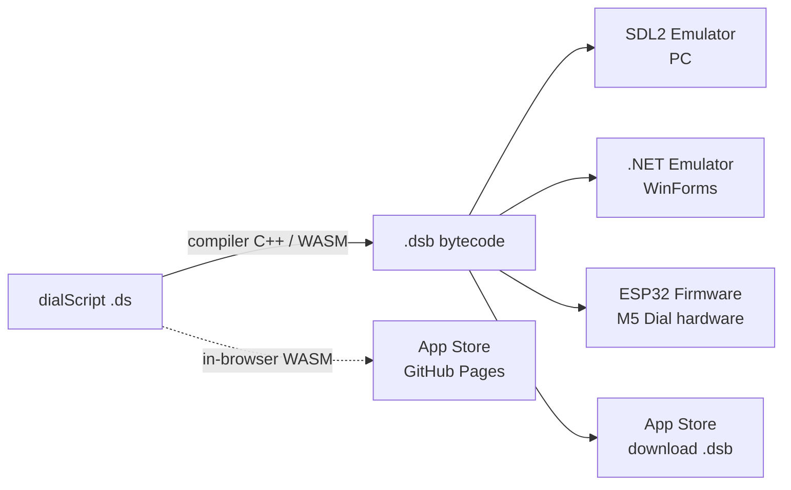

# dialOS Ecosystem Guide

> **Audience:** You want to write apps for dialOS, run them in an emulator, or put them on real M5 Dial hardware. This document tells you what works today, what's half-built, and where the gaps are — no marketing, just the current state of the code.

---

## 1. What is dialOS?

dialOS is a small virtual-machine operating system for the **M5 Dial** (ESP32-S3 with a 240×240 round touchscreen, rotary encoder, and button). You write apps in **dialScript** (`.ds`) — a JavaScript-flavored language — compile them to **`.dsb` bytecode**, and run the same bytecode on:

- a **browser** (WebAssembly compiler + app store),
- a **PC** (SDL2 emulator),
- **Windows/.NET** (WinForms emulator),
- or the **real device** (ESP32 firmware).

The bytecode is the contract: any host that implements the `PlatformInterface` (a HAL of ~130 native functions) can run it.



---

## 2. Quick start — pick your path

### Path A: Try it in the browser (zero install)
1. Open the **App Store** site (GitHub Pages, from `appstore/`).
2. Switch to the **Compile** tab, paste dialScript, hit **Compile**.
3. The WASM build of the C++ compiler runs in your tab and returns a `.dsb`.

> ⚠️ The Compile tab is a prototype. There is no in-browser VM yet — you can compile but not *run* in the browser.

### Path B: PC emulator (SDL2) — the most complete experience
```pwsh
# Windows with vcpkg (see docs/BUILD_SYSTEM.md for Linux/macOS)
cd compiler
cmake -S . -B build -DCMAKE_TOOLCHAIN_FILE=[vcpkg]/scripts/buildsystems/vcpkg.cmake
cmake --build build --config Release

# Compile an app
.\build\Release\compile.exe scripts\hello_world.ds hello_world.dsb

# Run it in the simulator
.\build\Release\test_sdl_emulator.exe hello_world.dsb
```
Or use the unified CLI: `.\dscli.ps1 compile <file.ds>` then `.\dscli.ps1 run <file.dsb>`.

**The SDL emulator supports:** display rendering with TTF fonts, mouse-driven touch, mouse-wheel encoder, real host-filesystem file APIs, HTTP download, **and the app-management APIs (install/uninstall/list/launch/validate)** backed by `apps/registry.json`. It is currently the reference implementation.

### Path C: .NET emulator (Windows)
```pwsh
cd dotnet
dotnet run --project DialOS.Gui
# File → Open .dsb → pick any .dsb file
```
See §5.3 for what this emulator supports — it's the newest and least battle-tested host.

### Path D: Real hardware (M5 Dial)
```pwsh
# PlatformIO flash
pio run -t upload          # builds + flashes src/main.cpp to M5 Dial
```
⚠️ **Read §6 first** — the firmware currently boots kernel demo tasks, not VM applets. VM task startup in `setup()` is commented out. Hardware support is real but needs wiring work (see §6.3).

---

## 3. Component inventory

| Component | Location | Status | Notes |
|---|---|---|---|
| dialScript language spec | `docs/` + `.github/instructions/dialscript_syntax.instructions.md` | ✅ Stable | JS-like; quirks listed in §4.1 |
| Compiler (C++ CLI) | `compiler/` → `compile` binary | ✅ Working | compile, disassemble, `--c-array`, `--debug` modes |
| Compiler (WASM) | `compiler/js_api.cpp` + CI `build-compiler-wasm.yml` | ✅ Working | In-browser compile via `appstore/` |
| Bytecode format v2 | `include/vm/bytecode.h` | ✅ Stable | `DSBC` magic, metadata, constants, functions, optional debug lines |
| VM core (C++) | `src/vm/vm_core.cpp` | ✅ Working | All opcodes incl. functions-as-values, exceptions, cooperative yield |
| SDL2 emulator | `compiler/sdl_platform.cpp` | ✅ Reference impl | Full display/input/FS/HTTP/app-mgmt |
| ESP32 platform | `src/esp32_platform.cpp` | ⚠️ Partial | Many APIs real, notable stubs & bugs — see §6 |
| Kernel (ESP32) | `src/kernel/` | ⚠️ Prototype | FreeRTOS tasks, custom heap, RamFS — demo-oriented, see §6.3 |
| .NET Runtime port | `dotnet/DialOS.Runtime` | ✅ Working | Bytecode loader, values, full opcode engine, native dispatch |
| .NET WinForms emulator | `dotnet/DialOS.Gui` (WinFormsPlatform + Form1) | ⚠️ Beta | Wired & runnable; real file IO + HTTP |
| .NET GuiPlatform | `dotnet/DialOS.Gui/GuiPlatform.cs` | 🚧 Unwired | Rich hardware *simulation*, but not connected to any UI yet |
| .NET tests | `dotnet/DialOS.Tests` | ✅ 60 passing | Unit + integration tests with real `.dsb` files |
| App Store web app | `appstore/` | ⚠️ Prototype | Browse works (index.json-driven); Compile tab works; no in-browser VM |
| GUI Designer | `gui_designer/` | 🚧 Prototype | Drag-drop widgets → exports `.ds` snippet / JSON |

---

## 4. Writing apps: what the language and VM actually support

### 4.1 dialScript language (implemented by the compiler)

```javascript
// Supported today:
var count: int = 0;                     // typed variables (var name: type = value*)
assign count count + 1;                 // assignment uses `assign` (not `=`!)
if (count = 3) { }                      // `=` is EQUALITY, `!=` is inequality
while (count < 10) { }
for (var i: 0; i < 5; assign i i + 1;) { }
function add(a: int, b: int): int { return a + b; }
class Timer { seconds: int;
    constructor(start: int) { assign this.seconds start; }
    tick(): void { assign this.seconds this.seconds - 1; }
}
var t: Timer(60);                       // instantiation (no `new` keyword)
var msg: `Count: ${count}`;             // template literals
var arr: [1, 2, 3];                     // arrays
try { } catch (e) { }                   // exceptions
var f: someFunction; f();               // functions as first-class values
os.display.clear(_color.black);         // _color.* compile-time constants
```

**Quirks that trip up newcomers** (these are *by design*, for now):
- `assign x value;` — not `x = value;`
- `=` means *equality comparison*, not assignment
- `and` / `or` / `not` — not `&&` / `||` / `!`
- Constructor calls look like typed declarations: `var t: Timer(60);`

### 4.2 VM features
- Stack-based interpreter, ~50 opcodes, cooperative scheduling (`execute(n)` slices)
- First-class function values (`LOAD_FUNCTION` / `CALL_INDIRECT` / `CALL_METHOD`)
- Objects, arrays, strings, floats, ints, null/bool
- `try/catch` exception opcodes
- Heap from `.dsb` metadata (`ValuePool` — fixed size, string interning)
- Sleep/yield without blocking the host

### 4.3 What's *not* in the VM yet
- **Timers/callback events** (`os.timer.*`, `os.events.*`) — the platform APIs exist but nothing invokes callbacks yet. This blocks: `encoder.onTurn(...)`, `touch.onPress(...)`, `setTimeout(...)` patterns. Poll `os.encoder.getDelta()` / `os.touch.isPressed()` in your main loop instead.
- **Multitasking for applets** — scheduler exists in the C++ kernel but applet↔applet isolation isn't exposed to dialScript.

---

## 5. Platform support matrix — **the discrepancies**

This is the most important table in this document. `os.*` API support per host, verified against the source code (not the older `KERNEL_API_SPEC.md`, which is partly aspirational).

Legend: ✅ implemented · 🟨 partial/simulated · ❌ stub returns default/`"Not supported"` · ⛔ not wired at all

| `os.*` namespace | SDL2 (C++) | ESP32 (C++) | .NET WinForms | .NET GuiPlatform |
|---|---|---|---|---|
| `console.*` | ✅ | ✅ | ✅ | ✅ (events) |
| `display.*` | ✅ TTF fonts | ✅ M5GFX | ✅ GDI+ | ✅ GDI+ |
| `encoder.*` | ✅ | 🟨 **delta bug** (§7.1) | ✅ | ✅ |
| `touch.*` | ✅ mouse | 🟨 `isPressed()` hardcoded `false` (§7.2) | ✅ mouse | ✅ |
| `system.*` | ✅ | 🟨 RTC is uptime; `sleep` blocks (§7.3) | ✅ | ✅ |
| `file.*` | ✅ host FS | ✅ RamFS (16 KB, 16 files, task-owned) | ✅ **real** host FS | 🟨 in-memory dict (lost on exit) |
| `dir.*` | ✅ | 🟨 prefix-simulated dirs | ✅ | 🟨 prefix-simulated |
| `gpio.*` | ✅ sim | ✅ real | ❌ base stub | 🟨 simulated values |
| `i2c.*` | ✅ sim | ✅ real Wire | ❌ base stub | 🟨 returns empty |
| `spi.*` | ✅ simulated echo | ✅ real SPI host + CS | 🟨 base stub | 🟨 base stub |
| `device.*` (driver model) | ✅ simulated devices | ✅ real WHO_AM_I probes | 🟨 base stub | 🟨 base stub |
| `buzzer.*` | ✅ SDL_mixer | ✅ `tone()` GPIO3 | ❌ base stub | 🟨 event only |
| `rfid.*` | ✅ sim | 🟨 raw I2C protocol, unverified | ❌ base stub | 🟨 scriptable sim |
| `timer.*` | ❌ needs callbacks | ❌ blocked | ❌ stubs return IDs, never fire | ❌ stubs return IDs, never fire |
| `memory.*` | ✅ | 🟨 reports *system* heap, not VM heap (§7.4) | 🟨 GC-based guess | 🟨 GC-based |
| `power.*` | ✅ sim | ✅ AXP2101 real | ❌ base stub | 🟨 scriptable sim |
| `app.*` (lifecycle) | ✅ exit/getInfo | ✅ exit/getInfo | ✅ | ✅ |
| `storage.*` | 🟨 | ❌ falls back to base stub | ❌ | 🟨 `"ramfs"` |
| `sensor.*` | ❌ | ❌ | ❌ | ❌ |
| `wifi.*` | ❌ | ❌ declared, not implemented | ❌ base stub | 🟨 fake "connected" |
| `http.*` | ✅ real requests | ❌ | ✅ **real** HttpClient | ❌ returns `{}` |
| `ipc.*` | ✅ sim | 🟨 | ❌ base stub | ❌ |
| `app-management.*` (install/list/launch/validate) | ✅ **full** (registry.json) | ❌ **falls back to "Not supported"** | ❌ | ❌ |

**Practical takeaways:**
1. **Only SDL gives you the full app-store lifecycle** (install → list → launch). If you're testing app-management flows, use the SDL emulator.
2. **Networking**: use SDL or .NET WinForms. Don't ship `http.*` calls expecting ESP32 to answer.
3. **File persistence**: real on SDL & .NET WinForms; ephemeral RAM on ESP32 (power loss = gone) and .NET GuiPlatform.
4. A dialScript app using only `console/display/encoder/touch/system/file` runs on **all four hosts**. Anything beyond that — check the table.
5. **External modules**: `os.device.*` + `os.spi.*` (driver model, `0x15xx`/`0x16xx`) are real on ESP32 and simulated on SDL — see [`DRIVER_MODEL.md`](./DRIVER_MODEL.md).

---

## 6. Hardware (ESP32) reality check

### 6.1 What works on the device today
- Display, encoder (PCNT hardware counter), touch coordinates, button
- Buzzer, battery/charging (AXP2101), deep sleep
- RamFS file API (volatile — 16 KB, cleared on reboot)
- GPIO/I2C passthrough
- Boot → kernel init → demo tasks (display/encoder/RamFS self-tests)

### 6.2 What does NOT work / is stubbed on device
- `touch_isPressed()` → always `false` (touch *coordinates* work)
- WiFi & HTTP → nothing (declared in HAL, no implementation)
- App management (`os.app.*` install/launch) → "Not supported" stubs
- RTC → returns seconds-since-boot

### 6.3 Firmware architecture caveats (read before hacking on `src/`)
The kernel layer is a **prototype**, currently more demo-harness than OS:

1. **VM applets are not started** — `setup()` has `createVMTask(...)` commented out. The device boots into demo tasks and never runs a `.dsb`.
2. **Three stacked allocators**: kernel `MemoryManager` (custom free-list on malloc) → RamFS (raw `realloc`, bypassing the kernel allocator) → VM `ValuePool`. The kernel allocator is effectively unused by the things it should serve.
3. **`MemoryManager` free-list traversal is unsafe** — walks embedded `next` pointers through *allocated* (user-writable) blocks; a heavy-writing workload can corrupt the walk. Plus `getAvailable()` doesn't account for block headers.
4. **No locking** — RamFS/MemoryManager/scheduler are touched from multiple FreeRTOS tasks with zero mutexes.
5. **`encoder_getDelta()` returns the absolute count**, not a delta — apps polling deltas will see runaway values on hardware.
6. **Kernel init grabs 50% of free heap at boot** and `panic()`/init-failure paths hard-hang.
7. Kernel tasks draw to `M5Dial.Display` **directly**, bypassing `PlatformInterface` — breaking the write-once-run-anywhere contract for anything they touch.

**If you want to help:** the highest-value firmware work is (a) wire up `createVMTask` to boot a real `.dsb` from RamFS/flash, (b) fix the encoder delta, (c) fix the free-list walk, (d) route all kernel drawing through `ESP32Platform`.

---

## 7. Known bugs & gotchas (cross-cutting)

| # | Area | Issue | Workaround |
|---|---|---|---|
| 7.1 | ESP32 encoder | `encoder_getDelta()` returns **absolute** position, not per-call delta; also `system_sleep` busy-blocks | Poll `getPosition()` and diff yourself; avoid long `sleep()` in UI loops |
| 7.2 | ESP32 touch | `touch.isPressed()` always `false` | Use coordinate changes or the button to infer presses (or fix it — one-liner in `esp32_platform.cpp`) |
| 7.3 | ESP32 system | RTC = uptime, `sleep()` = blocking `delay()` | N/A yet |
| 7.4 | ESP32 memory | `memory.getAvailable()` reports system heap, not your VM's `ValuePool` heap | Treat values as advisory |
| 7.5 | .NET loader | **Integrity check fails on older `.dsb` files** — the C++ compiler's hash/checksum algorithm doesn't match the .NET reimplementation on legacy artifacts | `BytecodeModule.Load(path, verifyIntegrity: false)` (the GUI passes `false` for you); recompile sources with the current compiler to get valid checksums |
| 7.6 | .NET emulator | Two platform classes coexist: `WinFormsPlatform` (wired, real IO/HTTP) and `GuiPlatform` (unwired, richer *simulated* hardware: RFID/battery/GPIO/buzzer events, but in-memory files and no HTTP) | Use `WinFormsPlatform` path (default in `Form1`); consolidation is on the roadmap |
| 7.7 | All hosts | `os.timer.*` and event-callback APIs return success but **never fire** | Polling loops (see §4.3) |
| 7.8 | App Store | `index.json` ships a placeholder entry pointing at `example.com` | Edit `appstore/index.json`, host real `.dsb` files |
| 7.9 | Bytecode | `.dsb` written by *older* compiler builds may differ in metadata/hash details from current | Recompile from source when in doubt |

---

## 8. Roadmap

Priorities reflect "what unlocks the most users". Contribution welcome on any item.

### Phase 1 — Make the device a real app platform *(highest value)*
- [ ] Boot a VM applet on ESP32: `createVMTask` reads a `.dsb` from flash and runs it
- [ ] Fix `encoder_getDelta()` (track last-read, return difference)
- [ ] Implement `touch_isPressed()` (M5Dial `getDetail().state`)
- [ ] Replace/repair the kernel `MemoryManager` free-list (bounds-safe walk + header accounting) or delete it in favor of VM `ValuePool`
- [ ] Add mutexes around RamFS / kernel singletons
- [ ] Route kernel task drawing through `ESP32Platform`

### Phase 2 — Callbacks & timers (unlocks event-driven apps)
- [ ] VM-level callback dispatch: platform raises event → VM invokes function value
- [ ] `os.timer.setTimeout/setInterval` on all hosts
- [ ] `encoder.onTurn / onButton`, `touch.onPress / onRelease` event APIs
- [ ] Non-blocking `system.sleep` on ESP32 (scheduler-driven wake)

### Phase 3 — Parity & networking
- [ ] ESP32: WiFi + HTTP (the HAL is already designed for it)
- [ ] ESP32: app install/launch (flash-backed registry, mirror SDL's `registry.json` design)
- [ ] .NET: consolidate `WinFormsPlatform` + `GuiPlatform` into one emulator platform (keep real IO/HTTP, adopt GuiPlatform's RFID/battery/GPIO simulation surface)
- [ ] Fix `.dsb` integrity hash mismatch (§7.5) — make C++ and .NET checksums agree, re-enable strict verification
- [x] Device driver model Tier 1: SPI namespace + device registry + probes (see `DRIVER_MODEL.md`)
- [ ] Driver model Tier 2: userspace (dialScript) driver registration; re-base `os.sensor.*` on the registry; thread task IDs through `VMState`

### Phase 4 — Ecosystem polish
- [ ] In-browser VM (run `.dsb` on the App Store site — WASM build of `vm_core`)
- [ ] App Store: real applet publishing flow (upload/PR-based registry, icons, versions)
- [ ] GUI Designer: more widgets, undo/redo, direct `.dsb` compile via WASM
- [ ] .NET MAUI host (cross-platform emulator from the same Runtime)
- [ ] Debugger: PC counter / stack / globals inspection in SDL & .NET emulators (ImGui panels exist in design docs)

---

## 9. Repository map

```
dialOS/
├── compiler/            # dialScript compiler (lexer/parser/codegen) + SDL emulator
│   ├── compile.cpp      #   CLI: compile .ds → .dsb, disassemble .dsb
│   ├── sdl_platform.*   #   Reference PC emulator (SDL2 + SDL_ttf + SDL_mixer)
│   └── js_api.cpp       #   WASM export (compile_source) for the browser
├── src/                 # ESP32 firmware (PlatformIO)
│   ├── main.cpp         #   Boot, kernel tasks (demo), VM task hooks (commented)
│   ├── esp32_platform.* #   PlatformInterface for M5 Dial hardware
│   ├── kernel/          #   Kernel prototype: scheduler, MemoryManager, RamFS, logging
│   └── vm/              #   VM core, bytecode, values (shared with compiler build)
├── include/vm/          # Shared headers: platform.h (HAL spec), bytecode.h, vm_core.h
├── dotnet/              # .NET 8 port
│   ├── DialOS.Runtime/  #   Bytecode loader, Value system, execution engine
│   ├── DialOS.Gui/      #   WinForms emulator (WinFormsPlatform wired; GuiPlatform unwired)
│   └── DialOS.Tests/    #   60 unit + integration tests
├── appstore/            # Static web app store (GitHub Pages) + WASM compiler host
├── gui_designer/        # HTML/JS layout designer prototype
├── scripts/             # ~50 example & test .ds programs (great starting points!)
├── docs/                # Architecture & specs (KERNEL_API_SPEC, VM_ARCHITECTURE, …)
└── dscli.ps1            # Unified dev CLI: compile / run / registry / setup
```

**Where to start reading code:**
- Want to write an app? → `scripts/hello_world.ds`, `scripts/timer.ds`, `scripts/touch_calculator.ds`
- Want to add an `os.*` API? → `include/vm/platform.h` (HAL contract) → `src/vm/vm_core.cpp` (dispatch) → each platform impl
- Want to port the VM to a new host? → Implement `PlatformInterface` (C++) or `IPlatform` (.NET); the VM needs nothing else

---

*Last verified against the codebase: 2026-02-24 (commit series ending `a05783f`). If something in this table disagrees with the code, the code wins — and please update this doc.*
