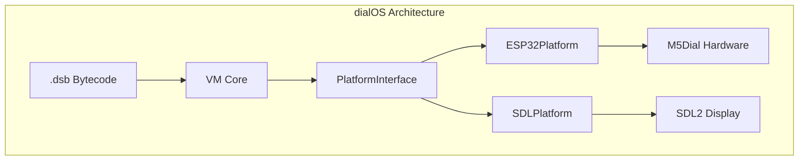

# System Design & Architecture

> **Note**: The main design documentation for dialOS is located in the `docs/` directory.
> This file serves as a pointer to the comprehensive design docs.

## Primary Design Documents

| Document | Location | Description |
|----------|----------|-------------|
| VM Architecture | [VM_ARCHITECTURE.md](../../VM_ARCHITECTURE.md) | VM system design, bytecode format, components |
| Kernel API Spec | [KERNEL_API_SPEC.md](../../KERNEL_API_SPEC.md) | 130+ native function specifications |
| Function Values | [FUNCTION_VALUE_DESIGN.md](../../FUNCTION_VALUE_DESIGN.md) | Callback/function support design |
| Native Functions | [NATIVE_FUNCTIONS.md](../../NATIVE_FUNCTIONS.md) | Native function implementation guide |

## Architecture Overview

dialOS is a portable virtual machine that runs on both PC (SDL2 simulator) and ESP32 (M5 Dial hardware) with identical bytecode execution.

## Key Components

- **VM Core**: Stack-based bytecode interpreter with cooperative multitasking
- **ValuePool**: Fixed-size heap memory manager
- **PlatformInterface**: Hardware abstraction layer (64+ APIs)
- **Kernel**: System services including RAMFS and task scheduler
- **Compiler**: dialScript → .dsb bytecode compiler

## Technology Stack

- **Language**: C++ (embedded-friendly)
- **Build**: PlatformIO for ESP32, CMake for PC
- **Display**: SDL2 (PC) / M5Dial library (ESP32)
- **Scripting**: dialScript (custom domain-specific language)

