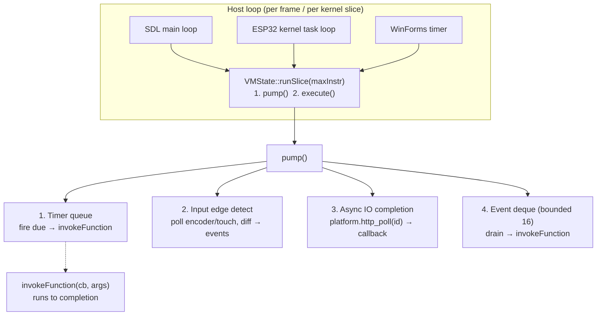

# Callback Execution Model: VM Event Loop + Language Scoping Rules

> **Status:** Design agreed via brainstorm (not yet implemented).
> **Unblocks:** 31 blocked kernel APIs — timers, input events, async HTTP, event handlers.
> **Companion doc:** [`../../DRIVER_MODEL.md`](../../DRIVER_MODEL.md) (hotplug events ride this same pump later).

## 1. Problem

`KERNEL_API_SPEC.md` lists 31 APIs as "🔒 Blocked (requires function support)". Investigation
showed this is stale: the VM **already has** function values (`LOAD_FUNCTION` →
`{functionIndex, paramCount}`), `CALL_INDIRECT`, and a synchronous, save/restore-safe
`VMState::invokeFunction(callback, args)`. What never existed is an **event source** —
nothing ever calls `invokeFunction`, and there is nowhere to park a callback between
registration and firing.

## 2. Decision: VM-internal poll-and-dispatch pump (Option A)

Chosen over platform-driven callback inversion (Option B — collapses into a queue the VM
drains anyway, with more coupling and reentrancy hazards) and kernel/FreeRTOS task queues
(Option C — breaks the single-cooperative-VM premise; separate future fork).

### Architecture

### Load-bearing rule

`pump()` runs **only at instruction boundaries**. `invokeFunction`'s existing
save/restore contract (PC, stack, call-depth unwinding on error) guarantees a callback
can never interleave with main code. This is the entire reentrancy story — no locks,
no preemption, deterministic on every host.

### v1 scope (decided)

| Feature | Mechanism | Platform changes |
|---|---|---|
| `os.timer.setTimeout/setInterval/clear*` | Native IDs `0x1700–0x1703`; handlers pop callback `Value` into VM timer queue (fixed 8 slots). **Zero platform calls.** | none |
| `encoder.onTurn/onButton`, `touch.onPress/...` | VM-side edge detection: pump snapshots polled state, synthesizes events. Native IDs `0x1710+`. | none |
| Async HTTP | `HTTP_GET_ASYNC = 0x1203` → new platform method `http_request_start(url, ...) → requestId`; completion via new `http_poll(requestId) → {pending/done/error, body}`. VM matches requestId → callback (max 4 pending). | **only genuine HAL additions in this design** |
| Callback syntax | Named functions only (v1). Lambdas/closures deferred. | none |

Sync `http.get` stays (works on SDL/.NET); documented as pump-blocking on ESP32; async is
the blessed path for hardware.

### Open items (resolve at implementation time)

1. **`sleep()` inside a callback**: `invokeFunction` does not handle `YIELD` from a
   callback today (would exit with frames on the call stack — latent bug). Decision:
   **hard error** "cannot sleep inside a callback" (continuations are out of scope).
2. **Event overflow policy**: bounded deque (16), drop-oldest with `console_warn`.
3. **ESP32 wiring**: applet VM startup in `setup()` is currently commented out
   (known kernel-review bug) — must be fixed for kernel-slice pumping.
4. **Spec drift cleanup**: `os.timer.*` vs `os.timers` naming; `http.get` marked
   "blocked" but implemented sync in .NET.

## 3. Language design: capture is forbidden — loudly

### Current scoping model (verified in code)

- **Two-level scoping**: module globals (name-keyed map) + per-function flat locals
  (`std::map<u8, Value>`, ≤255 slots). **No lexical scope chain.**
- **No block scoping**: if/while/for bodies reuse function-level slots (JS-`var`-like).
- **Identifier resolution**: local-first, else `LOAD_GLOBAL` fallback.

### Why implicit capture is structurally impossible

1. **Representation**: `Function = {functionIndex, paramCount}` — no environment field.
2. **Lifetime**: locals die with the frame; captured references would dangle; even copy
   capture is unsafe today because `Value` holds pool pointers subject to string GC.
3. **Semantics**: outer-local references compile to `LOAD_GLOBAL` → **silent `null` at
   runtime** (with only a console log). Capture attempts and typos fail silently today.

### Decisions (agreed)

1. **Nested function declarations → compile error.** Today they parse, then vanish
   silently in the compiler's statement dispatcher ("compiled in first pass, skip here").
   Functions must be declared at top level.
2. **Unresolved identifier → hard compile error.** If a name is neither a declared
   local/param nor a declared global (compiler knows the global list from pass 1), reject:
   *"unknown identifier 'x' in function 'f' (dialScript does not capture enclosing
   locals; use a global or pass as parameter)"*. Clean break; fix any scripts that
   relied on silent-null reads. This also catches typos.
3. **No implicit capture, ever.** If callback ergonomics demand it later, the agreed
   future path is **explicit, immutable, copy-only capture** (`capture (a, b)` syntax):
   `LOAD_FUNCTION` becomes `MAKE_CLOSURE`, snapshotting named values into a fixed env
   riding the pool-allocated `Function`. No boxes, no shared mutation, no GC changes.
   Mutable/boxed closures are rejected as a design goal for an 8 KB-pool target.

## 4. Frame architecture fix (bundled with event loop)

The pump fires many small callbacks, so per-call cost gates timer granularity. Bundled
changes:

- **Replace `CallFrame.locals` (`std::map<uint8_t, Value>`) with a flat
  `std::vector<Value>`** sized from function metadata (add `localCount` to the functions
  table in the bytecode format — params already known). One allocation per call, zero
  tree nodes.
- **Add a call-depth limit (~32 frames)**: runaway recursion currently dies as
  `OUT_OF_MEMORY`; make it a clean deterministic error.
- **Bytecode format version bump** for the functions-table change; .NET
  `BytecodeModule`/`ExecutionEngine` updated in lockstep (both hosts always in lockstep
  per the event-loop decision).

## 5. Implementation plan (lockstep: C++ + SDL, .NET, ESP32)

1. Compiler: nested-function error + unresolved-identifier error (both C++ and any
   compiler-adjacent validation) + `localCount` in functions metadata.
2. VM: flat locals, call-depth guard, sleep-in-callback error, timer queue + pump +
   `runSlice()`, input edge detection, native ID dispatch for `0x17xx`.
3. Platform: `http_request_start` / `http_poll` (SDL simulated-instant, .NET Task-backed,
   ESP32 non-blocking esp_http_client).
4. Hosts: SDL main loop + WinForms timer + ESP32 kernel slice call `runSlice()`;
   fix ESP32 applet startup wiring.
5. Tests: **fake-clock conformance tests** — advance virtual time, assert callback
   firing order — identical scripts run through C++ and .NET (doubles as the
   cross-runtime conformance suite baseline).
6. Docs: `KERNEL_API_SPEC.md` un-block the implemented APIs, new native-ID table rows,
   `ECOSYSTEM.md` matrix update; language rules into the dialScript syntax guide.
